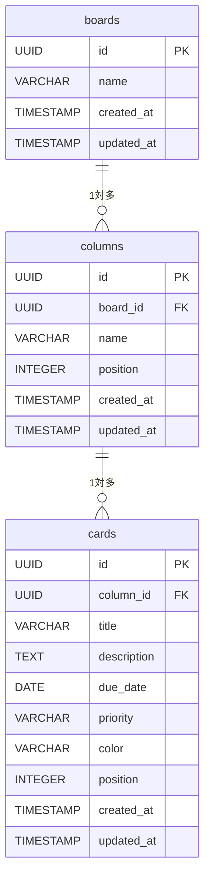

# データ構造・ER図

## 1. エンティティ概要

| テーブル名 | 説明 |
|-----------|------|
| boards | ボード（フェーズ4で複数ボードに対応） |
| columns | カラム（Todo / 進行中 / 完了） |
| cards | カード（タスク本体） |

---

## 2. ER図

---

## 3. リレーション

| リレーション | 種別 | 説明 |
|-------------|------|------|
| boards → columns | 1対多 | 1つのボードは複数のカラムを持つ |
| columns → cards | 1対多 | 1つのカラムは複数のカードを持つ |

---

## 4. テーブル定義

### boards テーブル

| カラム名 | 型 | 説明 |
|---------|-----|------|
| id | UUID | 主キー。自動生成 |
| name | VARCHAR(100) | ボード名 |
| created_at | TIMESTAMP | 作成日時 |
| updated_at | TIMESTAMP | 更新日時 |

### columns テーブル

| カラム名 | 型 | 説明 |
|---------|-----|------|
| id | UUID | 主キー。自動生成 |
| board_id | UUID | 所属するボードのID（外部キー） |
| name | VARCHAR(50) | カラム名（Todo / 進行中 / 完了） |
| position | INTEGER | カラムの表示順（左から0, 1, 2） |
| created_at | TIMESTAMP | 作成日時 |
| updated_at | TIMESTAMP | 更新日時 |

### cards テーブル

| カラム名 | 型 | 説明 |
|---------|-----|------|
| id | UUID | 主キー。自動生成 |
| column_id | UUID | 所属するカラムのID（外部キー） |
| title | VARCHAR(100) | カードのタイトル |
| description | TEXT | カードの説明文（フェーズ2） |
| due_date | DATE | 締切日（フェーズ2） |
| priority | VARCHAR(10) | 優先度（'high' / 'medium' / 'low' / 'none'）。デフォルト 'none' |
| color | VARCHAR(20) | カードの色（フェーズ4） |
| position | INTEGER | カラム内での表示順 |
| created_at | TIMESTAMP | 作成日時 |
| updated_at | TIMESTAMP | 更新日時 |
