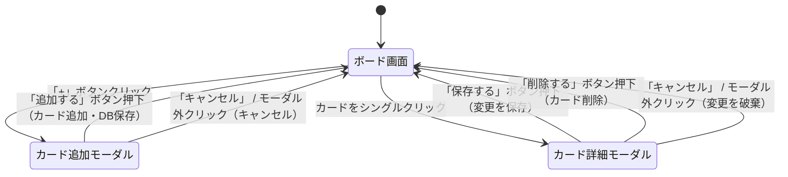

# 画面仕様

## 1. 画面構成（概略）

```
┌─────────────────────────────────────────┐
│  タスクボード（ヘッダー）                │
├───────────┬───────────┬─────────────────┤
│   Todo    │  進行中   │      完了       │
├───────────┼───────────┼─────────────────┤
│ [カード]  │ [カード]  │   [カード]      │
│ [カード]  │           │                 │
│ + 追加    │ + 追加    │   + 追加        │
└───────────┴───────────┴─────────────────┘
```

---

## 2. ボード画面（メイン画面）

| 要素 | 仕様 |
|------|------|
| ヘッダー | アプリ名「タスクボード」を表示。フェーズ4では現在のボード名も表示 |
| カラム | 「Todo」「進行中」「完了」の3列を横並びで表示。各カラムはスクロール可能 |
| カラムヘッダー | カラム名とカード枚数（例：Todo (3)）を表示。下段にソートボタンを配置 |
| ソートセレクトボックス | カラムヘッダーにセレクトボックスを配置。「手動」「優先度順」「期限順」の3択。選択でカードを並び替え。「手動」選択でソート解除 |
| カード | タイトルを表示。優先度バッジ（🔴高/🟡中/🟢低）と左ボーダー色で優先度を視覚化。フェーズ2以降は期限も表示。期限超過時は赤字で表示 |
| カード追加ボタン | 各カラム末尾に「+ カードを追加」ボタンを配置 |

---

## 3. カード追加

| 要素 | 仕様 |
|------|------|
| トリガー | 「+」ボタンを押すとカード追加モーダルが表示される |
| 入力UI | モーダルダイアログで表示。タイトル・説明文・期限日・優先度を入力 |
| 優先度選択 | セレクトボックスで「なし」「低」「中」「高」から選択。デフォルトは「なし」 |
| 追加ボタン | 「追加する」ボタンを押すとカードをカラム末尾に追加 |
| バリデーション | タイトルが空の場合は submit 時にエラーメッセージを表示して追加しない |
| キャンセル | 「キャンセル」ボタンまたはモーダル外クリックでモーダルを閉じる |
| 保存タイミング | 追加と同時にPostgreSQL（Spring Boot REST API経由）へ保存 |

---

## 4. カード詳細モーダル（フェーズ2）

| 要素 | 仕様 |
|------|------|
| トリガー | カードのタイトル部分をシングルクリック |
| 表示形式 | モーダルダイアログで表示 |
| 編集項目 | タイトル（テキスト入力）・説明文（テキストエリア）・期限日（日付ピッカー）・優先度（高/中/低/なし） |
| 保存 | 「保存」ボタンで変更を反映しSupabaseを更新 |
| 閉じる | 「×」ボタンまたはモーダル外クリックで閉じる（未保存の場合は変更を破棄） |

---

## 5. タイトル編集

| 要素 | 仕様 |
|------|------|
| トリガー | カードをシングルクリック |
| 表示形式 | カード詳細モーダルが表示される |
| 確定 | 「保存する」ボタンを押すと変更を保存してモーダルを閉じる |
| キャンセル | 「キャンセル」ボタンまたはモーダル外クリックで変更を破棄してモーダルを閉じる |
| バリデーション | タイトルが空の場合は submit 時にエラーメッセージを表示して保存しない |

---

## 6. カード操作

| 操作 | 仕様 |
|------|------|
| 移動 | カードをドラッグして別カラムまたは同カラム内の別位置にドロップして移動 |
| 削除 | カードをクリックして詳細モーダルを開き、「削除する」ボタンを押す（確認ダイアログなし） |

---

## 7. エラーハンドリング

### カード追加

| エラーケース | 対応 |
|-------------|------|
| タイトルが空のまま追加しようとした | submit 時に「タイトルは必須です。」とエラーメッセージを表示して追加しない |
| タイトルが100文字を超えた | HTML の `maxLength={100}` 属性により入力自体が制限される |

### データベース通信

| エラーケース | 対応 |
|-------------|------|
| APIへの書き込みに失敗した | モーダル内に「カードの作成（更新）に失敗しました。もう一度お試しください。」とエラーメッセージを表示する |
| 初期データ取得に失敗した | ボード画面にエラーメッセージを表示する |

### カード詳細

| エラーケース | 対応 |
|-------------|------|
| タイトルを空にして保存しようとした | submit 時に「タイトルは必須です。」とエラーメッセージを表示して保存しない |
| 期限日に不正な値が入力された | 日付ピッカーコンポーネントの標準バリデーションに委ねる |

### 共通

| エラーケース | 対応 |
|-------------|------|
| 予期しないJavaScriptエラー | コンソールにエラーログを出力する（本課題ではユーザー向け表示は任意） |

---

## 8. 画面遷移図


