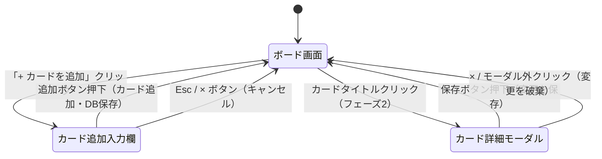

# 画面仕様

## 1. 画面構成（概略）

```
┌─────────────────────────────────────────┐
│  タスクボード（ヘッダー）                │
├───────────┬───────────┬─────────────────┤
│   Todo    │  進行中   │      完了       │
├───────────┼───────────┼─────────────────┤
│ [カード]  │ [カード]  │   [カード]      │
│ [カード]  │           │                 │
│ + 追加    │ + 追加    │   + 追加        │
└───────────┴───────────┴─────────────────┘
```

---

## 2. ボード画面（メイン画面）

| 要素 | 仕様 |
|------|------|
| ヘッダー | アプリ名「タスクボード」を表示。フェーズ4では現在のボード名も表示 |
| カラム | 「Todo」「進行中」「完了」の3列を横並びで表示。各カラムはスクロール可能 |
| カラムヘッダー | カラム名とカード枚数（例：Todo (3)）を表示 |
| カード | タイトルを表示。フェーズ2以降は期限も表示。期限超過時は赤字で表示 |
| カード追加ボタン | 各カラム末尾に「+ カードを追加」ボタンを配置 |

---

## 3. カード追加

| 要素 | 仕様 |
|------|------|
| トリガー | 「+ カードを追加」ボタンを押す |
| 入力UI | カラム末尾にテキスト入力欄とボタンをインラインで表示 |
| 追加ボタン | 入力欄が空でない場合のみ活性化。押下でカードを該当カラムの末尾に追加 |
| キャンセル | Escキーまたは「×」ボタンで入力欄を閉じる |
| 保存タイミング | 追加と同時にSupabaseへ保存 |

---

## 4. カード詳細（フェーズ2）

| 要素 | 仕様 |
|------|------|
| トリガー | カードのタイトル部分をクリック |
| 表示形式 | モーダルダイアログで表示 |
| 編集項目 | タイトル（テキスト入力）・説明文（テキストエリア）・期限日（日付ピッカー） |
| 保存 | 「保存」ボタンで変更を反映しSupabaseを更新 |
| 閉じる | 「×」ボタンまたはモーダル外クリックで閉じる（未保存の場合は変更を破棄） |

---

## 5. カード操作

| 操作 | 仕様 |
|------|------|
| 左に移動 | カード左端の「←」ボタン。Todoカラムでは非表示 |
| 右に移動 | カード右端の「→」ボタン。完了カラムでは非表示 |
| 削除 | カード右上の「×」ボタン。押下で即削除（確認ダイアログなし） |
| ドラッグ&ドロップ（フェーズ3） | カードをつかんで別カラムまたは同カラム内の別位置にドロップして移動 |

---

## 6. エラーハンドリング

### カード追加

| エラーケース | 対応 |
|-------------|------|
| タイトルが空のまま追加しようとした | 追加ボタンを非活性（disabled）にして押せない状態にする |
| タイトルが100文字を超えた | 入力欄の下に「100文字以内で入力してください」と赤字で表示し、追加ボタンを非活性にする |

### データベース通信

| エラーケース | 対応 |
|-------------|------|
| Supabaseへの書き込みに失敗した | 画面上部に「データの保存に失敗しました。しばらくしてから再試行してください。」とエラートーストを表示する |
| Supabaseからのデータ取得に失敗した | 「データを読み込めませんでした。ページを再読み込みしてください。」とエラーメッセージを表示する |
| ネットワーク接続が切れた | 「オフラインです。インターネット接続を確認してください。」とエラートーストを表示する |

### カード詳細（フェーズ2）

| エラーケース | 対応 |
|-------------|------|
| タイトルを空にして保存しようとした | 保存ボタンを非活性にする |
| 期限日に不正な値が入力された | 日付ピッカーコンポーネントの標準バリデーションに委ねる |

### 共通

| エラーケース | 対応 |
|-------------|------|
| 予期しないJavaScriptエラー | コンソールにエラーログを出力する（本課題ではユーザー向け表示は任意） |

---

## 7. 画面遷移図


